# Интернет-магазин свежеобжаренного кофе.

SPA приложение с клиент-серверной архитектурой.
1. Разработал Авторизацию/Регистрацию, JWT.
2. Личный кабинет пользователя с возможностью редактирования.
3. Страница с избранными товарами.
4. Корзина.
5. Панель администратора (Таблица товаров, добавление, удаление,
   редактирование товара)
6. Страница с товарами (Поиск, Сортировка, Фильтрация,
   Пагинация).
7. Страница товара (Возможность оставить отзыв).

# Админ Login/Password: m@mail.ru, Test1234
# deploy: http://81.163.30.243/

# Стек технологий
- React, Typescript
- React-Redux, Redux Toolkit
- SASS
- NodeJS, Express, MongoDB
- Docker

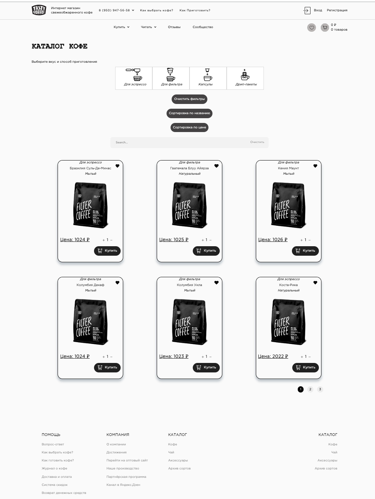

# Реализовано

- Авторизация и регистрация

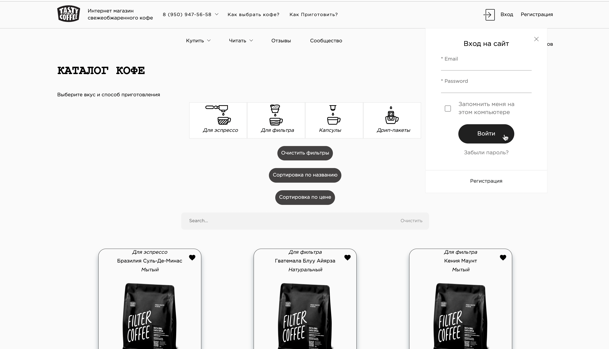
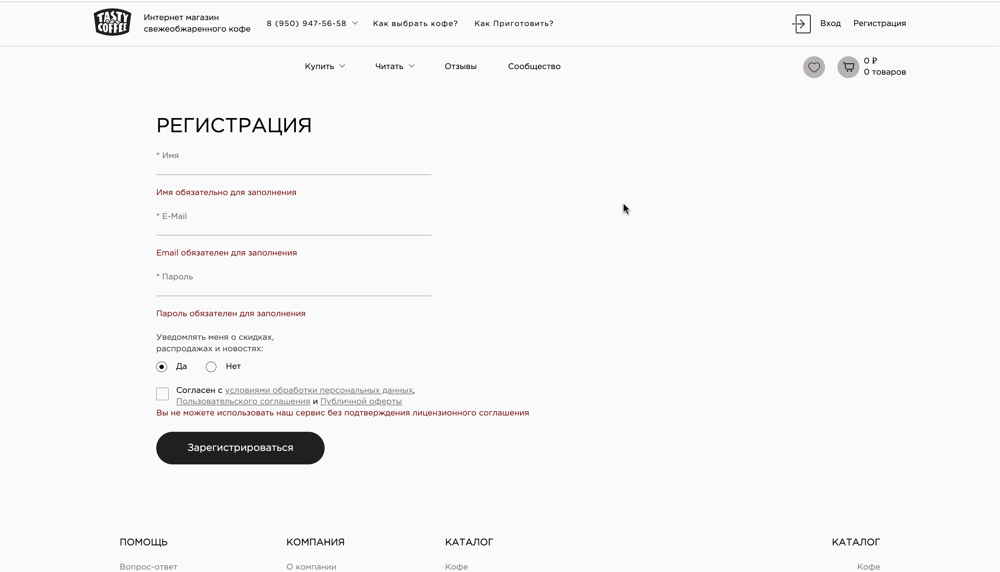

- Страница редактирования пользователя

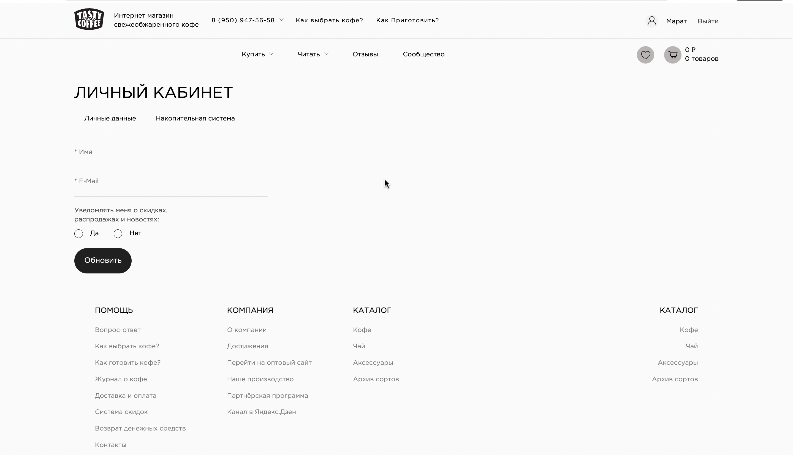

- Страница восстановления пароля

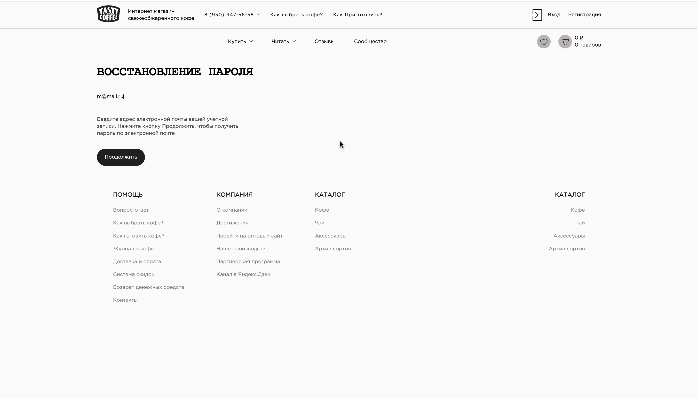
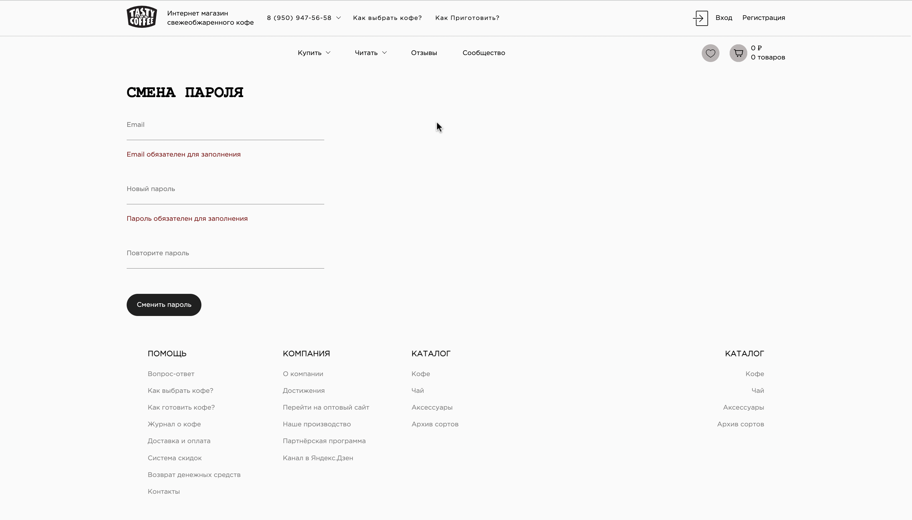

- Страница товара (Оставить отзыв могут только авторизованные пользователи)

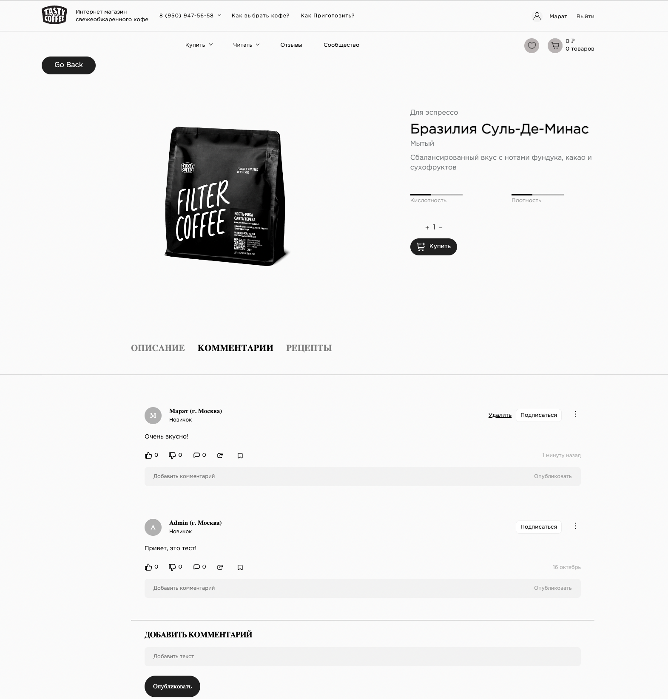

- Панель администратора(only user role is Admin) 

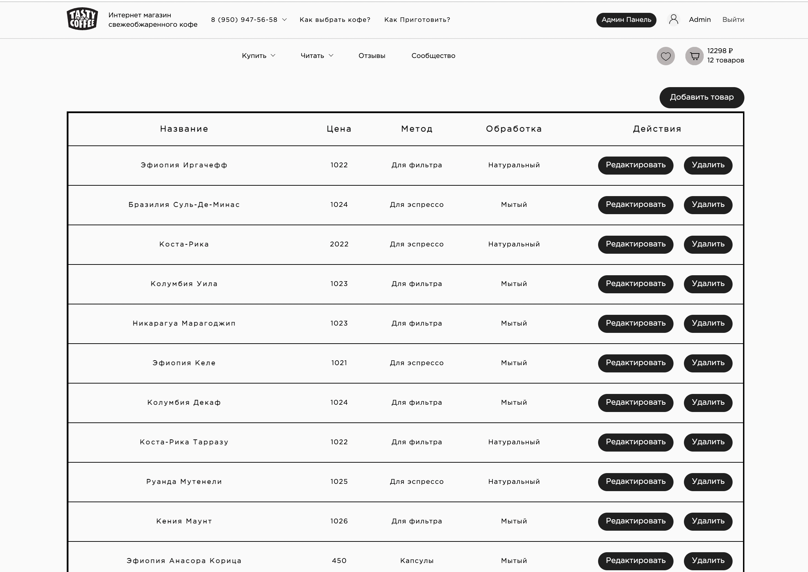

- Страницы: Корзина, Руководство по приготовлению, Избранное.  

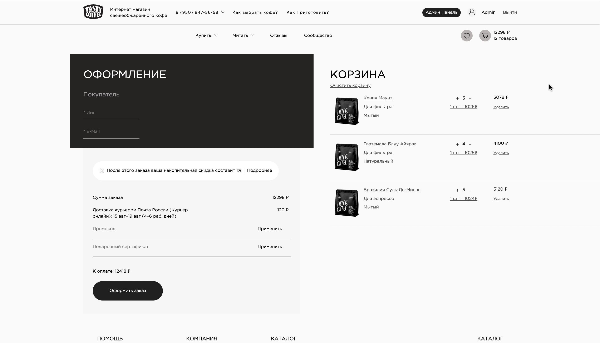
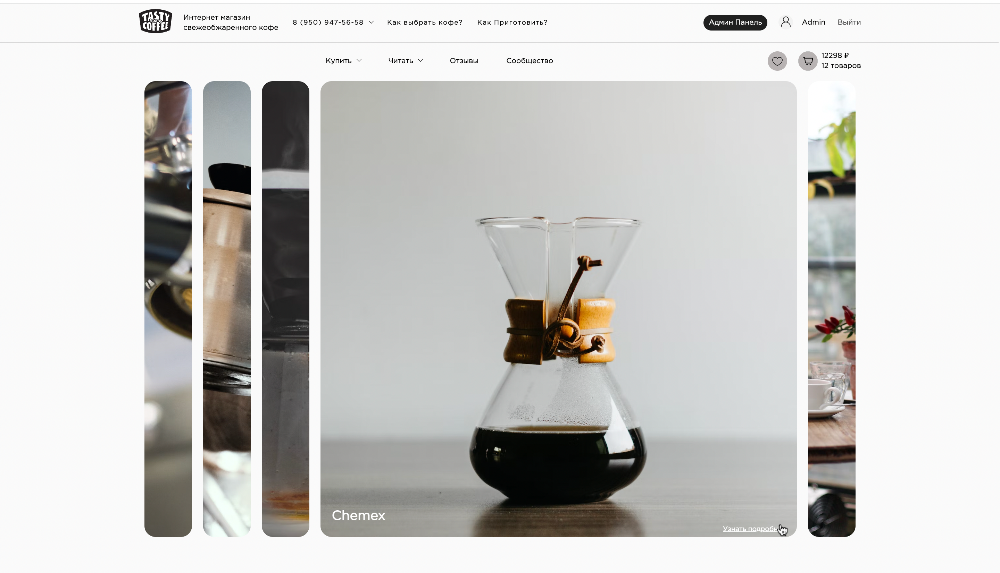
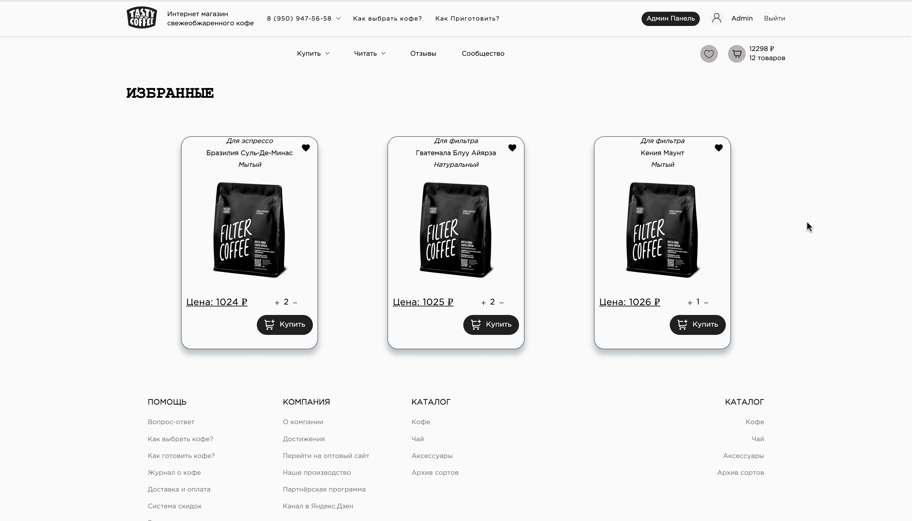

